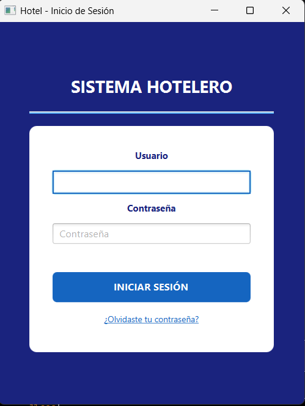
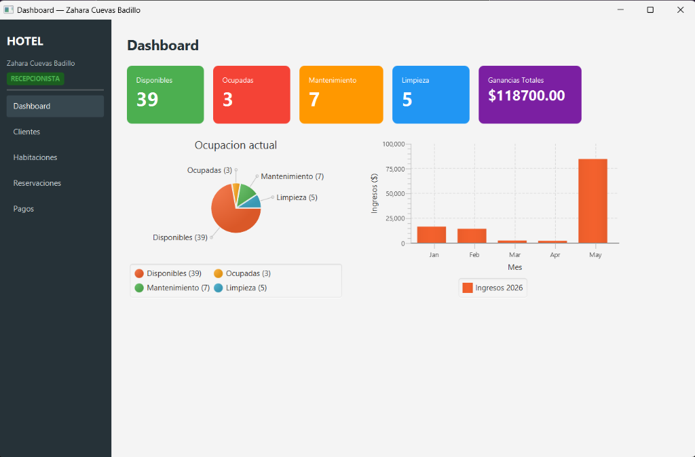
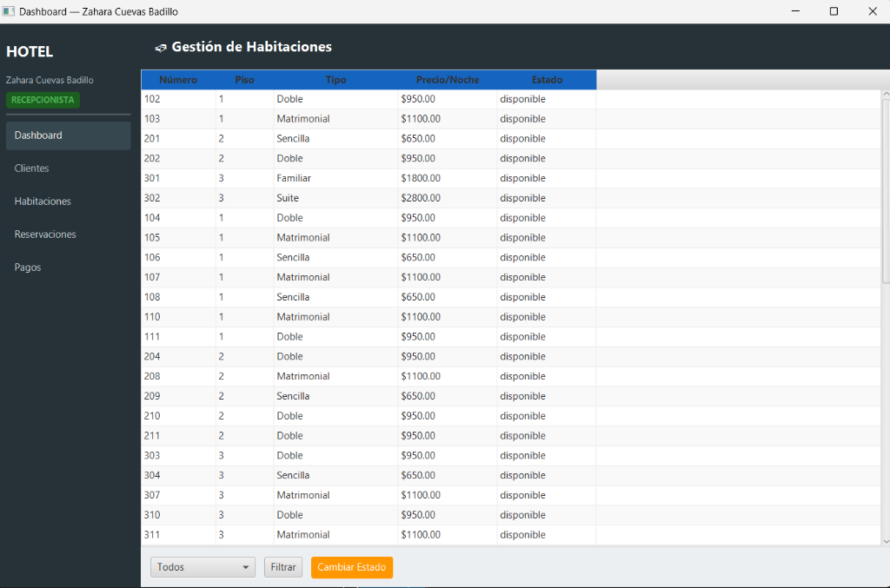
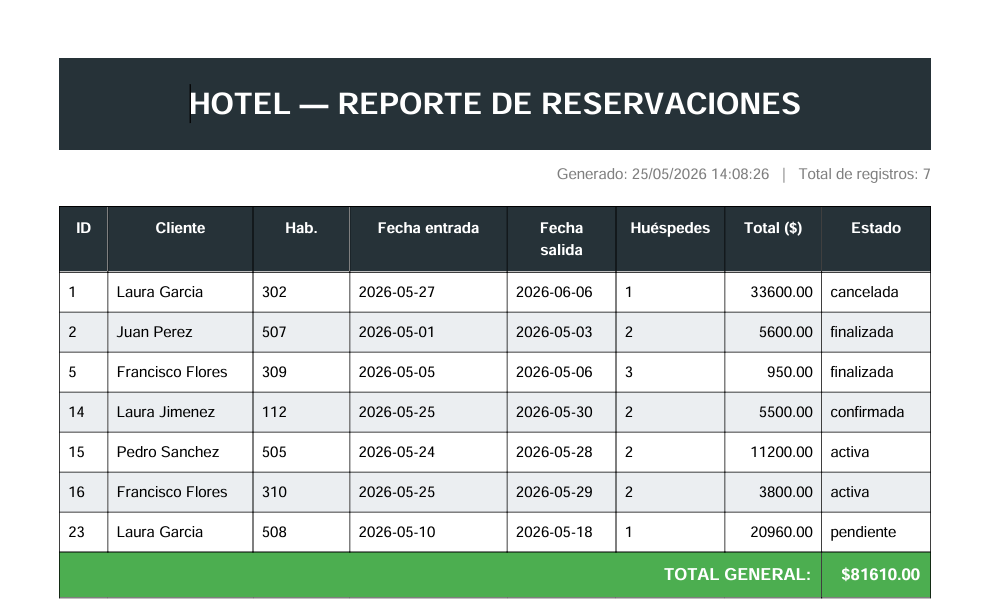

# Sistema de Reservaciones para Hotel

Aplicación desarrollada para facilitar la administración y el control diario de un hotel.  
El sistema permite gestionar huéspedes, habitaciones, reservas, cobros y reportes de manera organizada mediante una interfaz visual e intuitiva.

---

# Características Principales

## 1. Control de Acceso Seguro

### Inicio de Sesión
Permite a los empleados autorizados acceder al sistema mediante usuario y contraseña.

### Recuperación de Contraseña
Los usuarios pueden restablecer su contraseña mediante un proceso seguro de verificación y actualización.

---

## 2. Panel Principal (Dashboard)

El sistema muestra información importante de forma rápida y visual:

- Habitaciones disponibles.
- Habitaciones ocupadas.
- Habitaciones en mantenimiento.
- Gráfico de ingresos mensuales.

---

## 3. Gestión de Habitaciones

Permite administrar todas las habitaciones del hotel:

- Visualización completa de habitaciones.
- Actualización rápida de estados:
  - Disponible
  - Ocupada
  - En limpieza
  - En mantenimiento

---

## 4. Gestión de Reservas

### Creación de Reservas
Registro de:
- Datos del cliente.
- Habitación asignada.
- Fecha de entrada y salida.

### Precios por Temporada
El sistema calcula automáticamente el costo dependiendo de:
- Temporada alta.
- Temporada baja.
- Días festivos.

### Servicios Adicionales
Permite agregar extras como:
- Desayuno.
- Estacionamiento.
- Servicio de spa.

Los servicios se suman automáticamente al total de la reservación.

### Cancelación de Reservas
Posibilidad de cancelar reservaciones cuando sea necesario.

---

## 5. Generación de Reportes

El sistema permite:

- Consultar reservaciones por rango de fechas.
- Visualizar ingresos generados.
- Exportar reportes en formato PDF listos para imprimir o compartir.

---

# Tecnologías Utilizadas

- Java 21
- JavaFX
- Maven
- MySQL
- iText PDF (se uso para los reportes PDF)

---

# Requisitos Previos

Antes de ejecutar el proyecto es necesario contar con:

1. Java 21 instalado.
2. Maven instalado.
3. MySQL configurado.
4. Base de datos importada correctamente.

---

# Instalación y Configuración

## 1. Clonar el repositorio

```bash
git clone https://github.com/Capibaya/ProyectFinalTAP.git
```

## 2. Entrar a la carpeta del proyecto

```bash
cd ProyectFinalTAP
```

## 3. Configurar la base de datos

* Importar el archivo SQL correspondiente en MySQL.
* Configurar las credenciales de conexión en el proyecto.

---

# Ejecución del Proyecto

Desde la terminal, ejecutar:

```bash
mvn javafx:run
```

Esto abrirá la ventana principal de inicio de sesión del sistema.

---

# Estructura General del Proyecto

```plaintext
src/
 ├── controller
 ├── model
 ├── dao
 ├── view
 └── utils
```

---

# Capturas del Sistema

## Inicio de Sesión



## Dashboard



## Gestión de Habitaciones



## Reportes PDF



---

# Uso de Inteligencia Artificial

Durante el desarrollo se utilizaron herramientas de Inteligencia Artificial como apoyo para:

* Resolver dudas técnicas.
* Obtener sugerencias de estructura y organización del código.
* Detectar y corregir errores durante el desarrollo.

La lógica, integración y adaptación final fueron realizadas manualmente para cumplir con los requerimientos del proyecto.

---

# Autor

Proyecto desarrollado por Mendoza Granados Oswaldo, Moreno Rodriguez Roberto, García Rodríguez Victor Isaac
